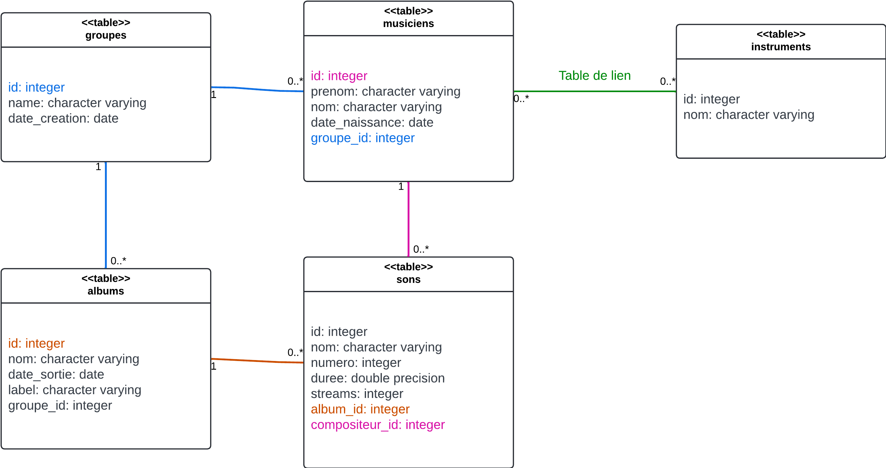

# Aide aux jointures

Ce document à pour but d'aider dans l'établissement de jointures concrètes.

On reprendra les exemples du [TP - Jointures](./Jointures.md) pour vous aider à mieux comprendre les exercices, et la correction.

## Pourquoi établir une jointure

Une jointure permet de relier deux tables, qui ont une relation d'appartenance.

En effet, une entreprise possède des salariés. On peut donc faire une jointure OneToMany (Un pour Plusieurs) entre les deux tables.

Cela va permettre d'obtenir les colonnes des entreprises et les colonnes des salariés dans **une même table**.

<p style="color:yellow">On fait une jointure si on a besoin de colonnes de plusieurs tables.</p>

## Comment détecter l'existence d'une jointure

### Avec un diagramme UML



Dès que vous voyez un trait entre deux tables : une jointure est possible.

Ici, il y a **5** jointures disponibles :
 - groupes - musiciens
 - musiciens - instruments
 - groupes - albums
 - albums - sons
 - sons - musiciens

### En analysant les colonnes des tables

Il y a trois types de champs :

1) Une **clé primaire** : souvent nommée `id`, chaque valeur est **unique** dans la table.

2) Les champs **clé étrangère** : ils se finissent souvent par `_id`, comme `groupe_id` par exemple.

3) Les autres champs, qui ne servent pas pour créer une jointure.

Il existe une jointure pour chaque **clé étrangère**.

## Comment faire une jointure en SQL

Pour les exemples, nous allons nous interesser à la jointure 'groupes - musiciens'.

### Partie `FROM`

Commencez par la partie `FROM` de la requête, on reviendra à la partie `SELECT` plus tard.

On écrit d'abord `FROM`, puis la première table de notre jointure. On pense à bien spécifier le *schéma* de la table.

Dans notre cas, notre schéma est `jointures`. Le nom de la première table est `groupes`. On écrit donc :

```sql
FROM groupes
```
On ajoute un *alias* à cette table avec `AS`. Cet alias sera souvent la ou les premières lettres du nom de la table.
```sql
FROM groupes AS g
```
<p style="color:yellow">En dehors de cette ligne, on remplace la table <code>groupes</code> avec la lettre <b>g</b>.</p>

### Partie `JOIN`

On écrit ensuite `JOIN`, puis la deuxième table de notre jointure. On n'oublie pas de bien spécifier le *schéma* de la table.

Dans notre cas, notre schéma est `jointures`. Le nom de la deuxième table est `musiciens`. On écrit donc :
```sql
FROM groupes AS g
JOIN musiciens
```
Ici aussi, on va donner un alias à cette table avec `AS`. On donne ici l'alias `m` :
```sql
FROM groupes AS g
JOIN musiciens AS m
```
<p style="color:yellow">En dehors de cette ligne, on remplace la table <code>musiciens</code> avec la lettre <b>m</b>.</p>

### Partie `ON`

On détermine la **clé étrangère** de la jonction (voir plus haut).

Ici, il s'agit du champs `groupe_id` de la table `musiciens`.

Puisque qu'on utilise un *alias* pour la table `musiciens`, on peut accéder a ce champ avec `m.groupe_id`.

On commence à écrire la partie `ON` de la requête.
```sql
FROM groupes AS g
JOIN musiciens AS m
ON m.groupe_id
```

On détermine ensuite la **clé primaire** approppriée (voir plus haut). Il faut que la clé étrangère et la clé primaire soient de **tables différentes**.

C'est pour cette raison que la clé primaire, dans cet exemple, est `groupes.id`.

Puisque qu'on utilise un *alias* pour la table `groupes`, on peut accéder a ce champ avec `g.id`.

On finit la partie `ON` de la requête.
```sql
FROM groupes AS g
JOIN musiciens AS m
ON m.groupe_id = g.id
```

<p style="color:yellow">On a fait <i>clé étrangère</i> = <i>clé primaire</i> </p>

<p style="color:red"> <b>La jointure est finie</b> </p>

## Comment utiliser une jointure

Dans la partie `SELECT` de la requête, on met le nom des colonnes que l'on suouhaite récupérer.

Attention à bien préciser l'*alias* de la table de chaque colonne.

Si on souhaite obtenir la colonne `nom` de la table `groupes`, on obtient :

```sql
SELECT g.nom
FROM groupes AS g
JOIN musiciens AS m
ON m.groupe_id = g.id
```

On peut aussi donner des *alias* aux colonnes dans le `SELECT`, pour pouvoir différencier des colonnes ayant le même libellé.

Par exemple, on donne `nom_de_groupe` et `nom_du_musicien` commes *alias*.

```sql
SELECT g.nom AS nom_de_groupe, m.nom AS nom_du_musicien
FROM groupes AS g
JOIN musiciens AS m
ON m.groupe_id = g.id
```

De la même manière, si on souhaite utiliser un filtre `WHERE`, on utilise toujours les *alias*

```sql
SELECT g.nom AS nom_de_groupe, m.nom AS nom_du_musicien
FROM groupes AS g
JOIN musiciens AS m
ON m.groupe_id = g.id
WHERE g.date_creation < '2008-01-01'
```
On sélectionne ici le nom des groupes, et les noms des musiciens, dans les groupes ayant été crées avant 2008.