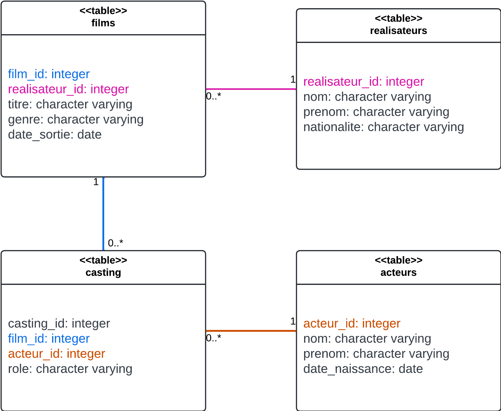

# TP - LIKE

Le but de ce TP est d'utiliser d'autres outils de SQL, qui sont moins importants que ceux vu dans le cours, mais qui font partie de l'écosystème SQL.

## Mise en place des ressources du TP

Importez ce fichier sql : [cinema.sql](./data/cinema.sql).

Voici le schéma UML simbolisant ces tables :



### Introduction de `BETWEEN`

`BETWEEN` est un mot clé utilisé dans les conditions.

##### Utilisation :

```sql
WHERE colonne BETWEEN value1 AND value2;
```

1) Forumulez une requête pour obtenir les acteurs nés entre 1970 et 1980 en utilisant `BETWEEN`.

<!-- ```sql
SELECT *
FROM acteurs
WHERE date_naissance BETWEEN '1970-01-01' AND '1979-12-31'
``` -->

2) Formulez une requête pour obtenir les films sortis dans les années 90 en utilisant `BETWEEN`.

<!-- ```sql
SELECT *
FROM films
WHERE date_sortie BETWEEN '1990-01-01' AND '1999-12-31'
``` -->

3) Formulez une requête pour obtenir les réalisateurs dont les prénoms ont une première lettre comprise entre 'D' et 'N', en utilisant `BETWEEN`.

<!-- ```sql
SELECT *
FROM realisateurs
WHERE prenom =! 'O'
AND prenom BETWEEN 'D' AND 'O'
``` -->

Attention ! `BETWEEN` ne peux qu'avoir des bornes inclusives.

Il vaudra mieux utiliser des conditions plus classiques, afin de pouvoir mieux gérer la question de l'inclusivité des bornes.

> Rappel : borne inclusive x>=3, borne exclusive x>3

Reformulez les trois questions précédentes, en utilisant des bornes exclusives.

### Introduction de `LIKE`

A contrario de `BETWEEN`, qui n'est pas très interessant, `LIKE` est nécessaire à une maitrise importante de SQL.

`LIKE` permet de jouer sur les champs de texte (*character varying* par exemple).

##### Utilisation :

```sql
WHERE colonne LIKE 'expression'
```

L'interet de `LIKE` réside dans le fait qu'on puisse filtrer sur des champs de texte qui vérifient des *patterns*.

Par exemle,
```sql
SELECT * FROM cinema.acteurs
WHERE nom LIKE `%osling'
```
donne tous les acteurs dont le nom finit par 'osling', tels que 'Gosling', 'Aosling', mais aussi 'ABCDosling', etc...

Il existe deux characters spéciaux à utiliser dans les exprssions de `LIKE` :
 - '%' permet de remplacer tous les charactères, peut importe leur nombre.
 - '_' permet de remplacer n'importe quel charactère, mais qu'un seul charactère uniquement.

4) Sélectionnez les acteurs avec un prénom commenceant par 'K'.

<!-- ```sql
SELECT *
FROM acteurs
WHERE prenom LIKE 'K%'
``` -->

5) Sélectionnez les films avec un titre finissant par 'd'.

<!-- ```sql
SELECT *
FROM films
WHERE titre LIKE '%d'
``` -->

6) Sélectionnez les films avec 'The' dans leur titre.

<!-- ```sql
SELECT *
FROM films
WHERE titre LIKE '%The%`
``` -->

7) Sélectionnez les réalisateurs des films ayant deux 'l' à la suite dans leur titre.

<!-- ```sql
SELECT r.nom
FROM realisateurs AS r
JOIN films AS f
ON r.realisateur_id = f.realisateur_id
WHERE f.titre LIKE '%ll%'
``` -->

8) Sélectionnez les acteurs ayant joué dans des films ayant au moins deux 'l' dans leur titre.

<!-- ```sql
SELECT a.nom
FROM acteurs AS a
JOIN casting AS c
ON a.acteur_id = c.acteur_id
JOIN films AS f
ON f.film_id = c.film_id
WHERE f.titre LIKE '%l%l%'
``` -->

On remarque que 'La La Land' n'est pas dans cette dernière liste. Pourquoi ?

Pour pallier ce problème, on peut utiliser la fonction UPPER(texte), qui renvoie tout le texte en majuscules.

9) Donnez le titre (avec la casse correcte) des films ayant au moins deux 'l', peut importe leur casse, dans leur titre.

<!-- ```sql
SELECT titre
FROM films
WHERE UPPER(titre) LIKE UPPER('%l%l%')
``` -->

10) Quels sont les acteurs des comédies ?

```sql
SELECT a.nom
FROM acteurs AS a
JOIN casting AS c
ON a.acteur_id = c.acteur_id
JOIN films AS f
ON f.film_id = c.film_id
WHERE UPPER(f.genre) LIKE UPPER('comédie')
```

11) Comment trouver les rôles avec le charactère '_' dedant, comme 'Bruce Wayne _ Batman' ?

```sql
SELECT role
FROM casting
WHERE role LIKE '%!_%' ESCAPE '!'
```

<details>
    <summary> <i> Indice </i> </summary>
    <a href=https://stackoverflow.com/a/14518639>Escape caracters in LIKE queries</a>
</details><br>

12) Quels sont les films dans lequels le réalisateurs, et au moins un des acteurs, possède un 'e' dans leur nom ou prénom ?

```sql
SELECT DISTINCT a.nom
FROM acteurs AS a
JOIN casting AS c
ON a.acteur_id = c.acteur_id
JOIN films AS f
ON f.film_id = c.film_id
JOIN realisateurs AS r
ON r.realisateur_id = f.realisateur_id
WHERE (r.nom LIKE '%e%' OR r.prenom LIKE '%e%')
AND (a.nom LIKE '%e%' OR a.prenom LIKE '%e%')
```