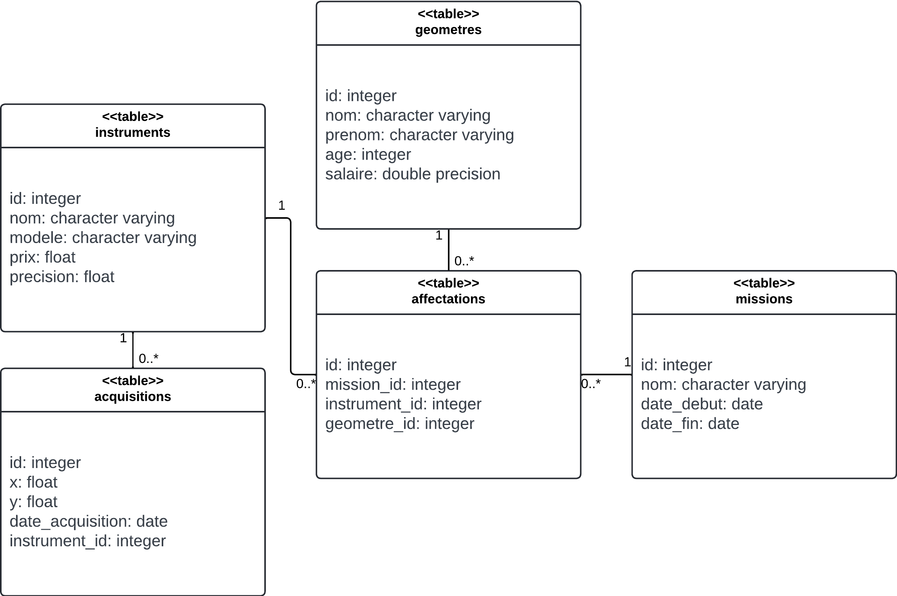

# TP - Préparation

Le but de ce TP est de se préparer à l'épreuve écrite.

Chaque question possède un niveau de difficulté, annoncé par des **\#**.

Voici la répartition des points suivant la difficulté de la question :

<table>
    <thead>
        <th scope="col">Difficulté</th>
        <th scope="col">Points</th>
        <th scope="col">Nombre de questions<th>
    </thead>
    <tbody>
        <tr>
            <td>#</td>
            <td>1</td>
            <td>8</td>
        </tr>
        <tr>
            <td>##</td>
            <td>3</td>
            <td>4</td>
        </tr>
        <tr>
            <td>###</td>
            <td>5</td>
            <td>2</td>
        </tr>
    </tbody>
</table>

Vous pouvez réaliser les questions dans l'ordre que vous voulez, et passer celles que vous souhaitez. Le score maximal est de 30, mais la note maximale est atteinte dès 20 points.

## Présentation des ressources

Voici le diagramme UML des 5 tables à considérer :



## Questions de cours

1) Quelles sont les colonnes qu'on utilise pour réaliser une jointure ? **\#**. Identifiez ces colonnes et leur fonctions dans le cadre de la jointure entre les tables `instruments` et `acquisitions`. **\#**

<!-- > On utilise un couple de clés de jointures : une **clé primaire** et une **clé étrangère** -->
<!-- > Dans le cadre de la jointure entre `instruments` et `acquisitions`, la clé primaire est la colonne `id` de la table `instruments`, et la clé étrangère est la colonne `instrument_id` de la table `acquisitions`. -->

2) En quelques mots, expliquez l'architecture Client - Serveur. **\#\#**

<!-- > Des **clients** envoient des **requêtes** au **serveur**, qui **calcule** des **réponses** renvoyées aux clients. -->

## Questions sur les tables

Pour chaque question, vous devez formuler une requête qui répond à la question.

3) Quels sont les géomètres avec un salaire supérieur à 2200 euros ? **\#**

<!-- ```sql
SELECT prenom, nom FROM geometres
WHERE salaire > 2200
``` -->

4) Quels sont les missions en cours le 19 octobre 2023 ? **\#**

<!-- ```sql
SELECT nom FROM missions
WHERE date_debut < '2023-10-19'
AND date_fin > '2023-10-19'
``` -->

5) Quels sont les instruments utilisés sur la mission numéro 8 ? **\#**

<!-- ```sql
SELECT i.nom
FROM instruments AS i
JOIN affectations AS a
ON i.id = a.instrument_id
JOIN missions AS m
ON m.id = a.mission_id
WHERE m.id = 8
``` -->

6) Quelle est la mission avec la moyenne d'age des géomètres la plus élevée ? **\#\#**

<!-- ```sql
SELECT m.nom
FROM missions AS m
JOIN affectations AS a
ON m.id = a.mission_id
JOIN geometres AS g
ON g.id = a.geometre_id
GROUP BY m.id
ORDER BY AVG(g.age) DESC
LIMIT 1
``` -->

7) Quel est le prix total de tous les instruments ? **\#**

<!-- ```sql
SELECT SUM(prix) FROM instruments
``` -->

8) Quel est le salaire moyen des 10 géomètres les plus agés ? **\#\#**

<!-- ```sql
SELECT AVG(salaire) FROM (
    SELECT salaire FROM geometres
    ORDER BY age DESC
    LIMIT 10
)
``` -->

9) Quelles sont les acquisitions éloignées de plus de 10m de l'origine ? **\#**

> Indications : x, y sont en mètres.

> Rappel : $ dist = \sqrt{(x_{A}-x_{B})^2+(y_{A}-y_{B})^2} $