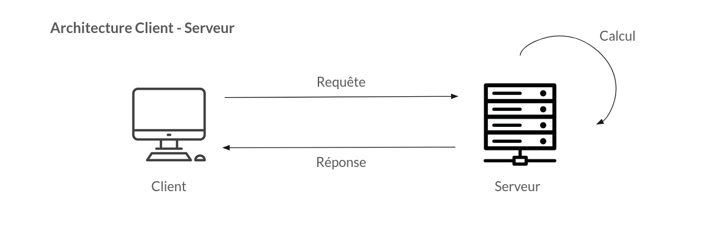

# Cours d'introduction aux bases de données

G2 - 2024

---

# TP1 - Manipulation de PgAdmin4

PgAdmin est un outil d'admninistration de bases de données.

---

## Installations

Rendez vous sur [EDB Downloads](https://www.enterprisedb.com/downloads/postgres-postgresql-downloads) et téléchargez la dernière version pour votre système d'exploitation.

Lancez l'installation et avancez dans le processus. Attention à bien sélectionner les quatre composants : 

Puisque nous sommes dans un environnement local, je vous conseille d'utiliser un mot de passe facile à retenir, tel que `postgres`. Laissez les autres paramètres par défault.

Nous avons installé le serveur PostgreSQL en local, ainsi que l'interface graphique PgAdmin4 pour administrer notre nouvelle base de données.

---

## Connection au Serveur

Ouvrez PgAdmin4.

Dans l'onglet à gauche, vous trouverez le terme `Serveur`, puis `PostgreSQL 16` : cliquez dessus, puis renseignez le mot de passe choisi plus tôt. Je vous conseille vivement de cocher la case pour se souvenir du mot de passe.

### Rappel : Architecture Client - Serveur

Ici, nous avons installé un serveur local, sur le port `5432` de notre machine (voir les propriétés en faisant `Serveur -> PostgreSQL -> clic droit -> Propriétés -> Connexion`).

Ainsi, une partie de votre PC va envoyer des requêtes, et une autre, complètement indépendante, va recevoir ces requêtes, faire des calculs puis renvoyer une réponse.

L'architecture Client - Serveur est préservée.

## Création d'une base

Notre serveur local est vide. Nous allons créer une nouvelle base de donnée. De manière générale, un projet = une base de données.

`Serveurs -> PostgreSQL 16 -> Bases de données -> clic droit -> Créer -> Base de données`

Nous avons maintenant une base de données `SQL G2`, qui nous suivra durant tout le cours.

## Import d'une table CSV

Télechargez le fichier suivant : [table professeurs.csv](./data/professeurs.csv).

Nous allons maintenant pousser nos données csv sur le serveur, dans une nouvelle table.

### Création de la table

Parcourez l'arborescence pour pouvoir créer une table :
`SQL_G2 -> Schémas -> public -> Tables -> clic droit -> Créer -> Table`

> Les schémas sont des sortes de sous dossiers. Vous pourriez créer un schéma pour chaque TP par exemple.

Donnez le nom `professeurs` à votre table.

Allez dans l'onglet `Colonnes`. Ajouttez une colonne pour chaque colonne du fichier csv.

> Attention aux types ! Les nombres entiers sont des `integer`, les textes sont des `character varying`, et les dates... des `date`.

Pas besoin de toucher aux autres options pour l'instant.

Vous pouvez afficher votre nouvelle table avec `clic droit -> Afficher -> Toutes les lignes`.

Vous pouvez aussi appuyer sur ce bouton :

> Cette page ne se raffraichit pas toute seule. Si vous modifiez la table, appuyez sur `F5` pour raffrachir l'affichage.

Nous avons préparé notre table : elle est prête à recevoir des données.

### Import des données

Importez le csv avec l'outil de PgAdmin.

> Attention à bien être en mode 'Import'

Nos données sont bien importées, on peut maintenant faire des requêtes sur la base.

> *Si vous avez un problème pour importer les données, vous pouvez aussi utiliser l'éditeur de requêtes et [ce fichier](./data/professeurs.sql). Appelez moi !*

## Ouverture de l'éditeur de requêtes

Afin de pouvoir écrire des requête, on va ouvrir l'éditeur de requête.

`SQL_G2 -> clic droit -> Editeur de requêtes`

Vous pouvez aussi cliquer sur ce bouton :

Vous êtes prets à requêter la base de données en utilisant SQL, rendez vous sur [TP - Requêtes de base](./Requetes_de_base.md).
